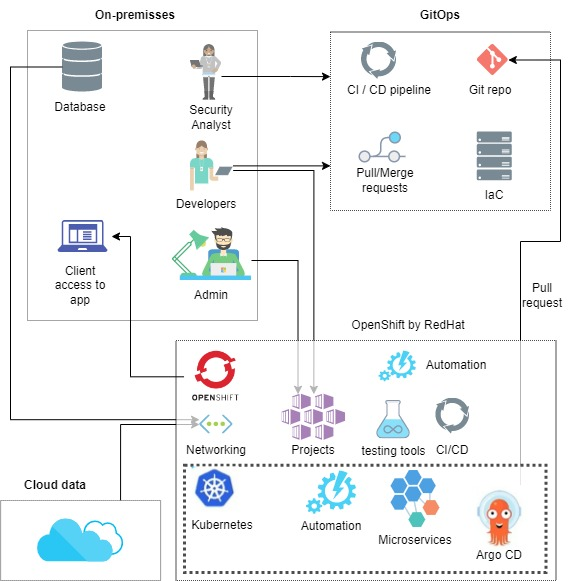

:imagesdir: images
:couchbase_version: current
:toc:
:project_id: how
:icons: font
:source-highlighter: prettify
:tags: guides,meta

= POC-application-Modernizarion

application modernization using OpenShift, GitOps, Argo CD, and multipe namespaces 

== Overview

One of the trending methods of software modernization is through rearchitecting approach. 
Working with Monolithic applications have many downsides and doesn’t meet the required demands anymore. New technologies, Cloud environments can be used to overcome this challenge and provide more flexible, cost efficient, more secure, reliable, and easy to use methods for clients, programmers, and the business owners.

== Advantages of OpenShift, GitOps and Argo CD

Openshift, is based on Kubernetes, it's RedHat product which is handing the complex task of managing the containers with automation and AI, Plus, it provides spectacular privacy and security. 
GitOps, as you may already now, it providing collaboration and versionining environment with IaaC. 
And the Key point, which is Argo CD, it's a Kubernetes agent which is acting as an intermediate tool to get the data from the repo and send them to Kubernetes environment. 

== Design / Built solution

Using different namespaces is very useful and it's adding another layer of security and stability to the system 
It can be used as different environment stage (Production, Developing, Production) 
or Can be used for different departments as well which helps to dedicate necessary resources, limitations, security and protection 
which is very valubale feature for a financial application.  

```

```


